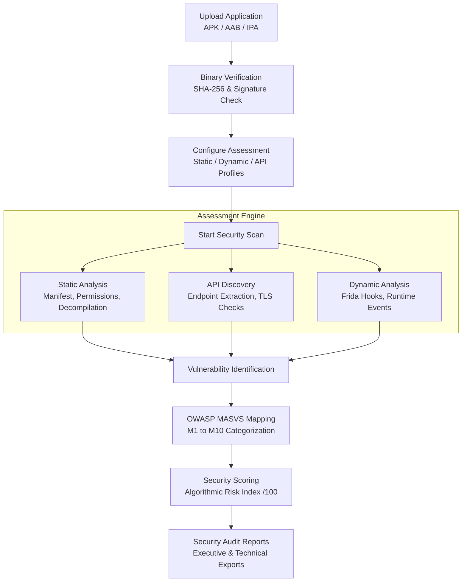
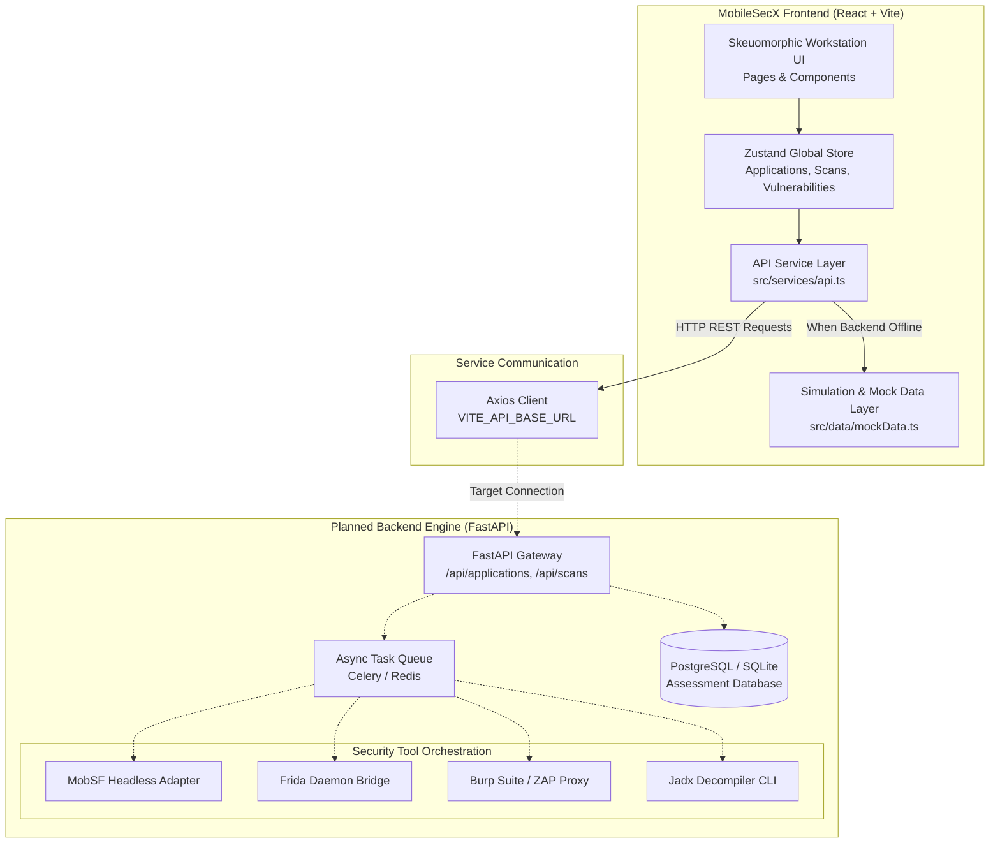

# MobileSecX

> Mobile Application Security Testing Framework for centralized Android and iOS security assessment.

[](https://react.dev/)
[](https://www.typescriptlang.org/)
[](https://vitejs.dev/)
[](https://tailwindcss.com/)
[](https://github.com/)
[](LICENSE)

---

## Project Overview

**MobileSecX** is a specialized web-based mobile application security testing workstation designed for security researchers, penetration testers, AppSec engineers, and cybersecurity students. The platform centralizes mobile assessment workflows—spanning binary ingestion, static code analysis, dynamic runtime monitoring, REST API assessment, and OWASP compliance auditing—into a single, unified interface.

Traditional mobile application security testing often requires running disconnected command-line utilities, third-party decompiler GUIs, dynamic instrumentation scripts, and network interception proxies. MobileSecX unifies these disparate assessment phases into a structured, operator-friendly pipeline modeled after industry standards including the **OWASP Mobile Application Security Verification Standard (MASVS)**.

---

## Features

| Feature Area | Description | Implementation Status |
| :--- | :--- | :---: |
| **Executive Security Dashboard** | Real-time posture score, metric counters, vulnerability distribution, and historical 7/30/90-day trend analytics. | ✅ Implemented |
| **Application Inventory** | Centralized target repository tracking package names, versions, platform types, binary sizes, and cryptographic checksums (SHA-256 / MD5). | ✅ Implemented |
| **Target Binary Ingestion** | Drag-and-drop file upload workspace supporting Android (`.apk`, `.aab`) and iOS (`.ipa`) packages with client-side validation. | ✅ Implemented |
| **Scan Profile Configuration** | Modular assessment configuration for Static, Dynamic, API, and Full assessment profiles with individual capability toggles. | ✅ Implemented |
| **Live Scan Pipeline** | Multi-stage pipeline monitor (Parsing → Manifest → Permissions → Code → API → Dynamic → Report) with real-time simulated security console logs. | 🧪 Simulated |
| **Vulnerability Triaging** | Searchable findings table with severity filtering (Critical, High, Medium, Low, Info), CVSS v3.1 scoring, and status management. | ✅ Implemented |
| **Deep Finding Inspector** | Detailed vulnerability dossiers containing affected components, technical evidence consoles, proof-of-concept steps, and remediation guidance. | ✅ Implemented |
| **Mobile API Security** | Dedicated API testing workstation displaying discovered endpoints, HTTP verbs, authentication methods, TLS status, and security rule matrices. | ✅ Implemented |
| **Dynamic Runtime Analysis** | Instrument monitor reporting ADB/emulator connectivity, Frida daemon hooks (SSL Pinning, Root Detection), and intercepted runtime events. | 🧪 Simulated |
| **Reverse Engineering Explorer** | Interactive archive tree viewer inspecting `AndroidManifest.xml`, decompiled Java classes, Smali bytecode, and extracted assets. | 🧪 Simulated |
| **OWASP MASVS Mapping** | Compliance assessment matrix mapped directly against the OWASP Mobile Top 10 categories (M1 through M10). | ✅ Implemented |
| **Differential Scan History** | Historical audit log with a side-by-side comparison modal tracking score progression, new flaws, resolved bugs, and persistent regressions. | ✅ Implemented |
| **Report Generation** | Multi-format security assessment report generator supporting Executive, Technical, and OWASP Compliance summaries. | 🧪 Simulated |
| **System Settings** | Workstation configuration for external FastAPI backend URLs, Burp Suite proxy routing, and Frida instrumentation ports. | ✅ Implemented |
| **Live FastAPI Microservice** | Production Python backend to execute actual MobSF, Jadx, Frida, and Burp Suite automation. | 🚧 Planned |

---

## Screenshots

### Security Workstation Dashboard
<!-- Add dashboard screenshot here: docs/screenshots/dashboard.png -->

*Figure 1: Executive security workstation dashboard displaying overall posture score, vulnerability distribution, and recent applications.*

### Target Applications Workspace
<!-- Add applications screenshot here: docs/screenshots/applications.png -->

*Figure 2: Application inventory management view displaying target platform, checksums, and security ratings.*

### Active Security Scanner & Live Console
<!-- Add scan screenshot here: docs/screenshots/scan.png -->

*Figure 3: Multi-stage scan pipeline monitoring real-time static/dynamic analysis progression with security audit logs.*

### Vulnerability Triaging & Evidence Dossier
<!-- Add vulnerabilities screenshot here: docs/screenshots/vulnerabilities.png -->

*Figure 4: Vulnerability management table with CVSS scores, OWASP tags, and detailed remediation panels.*

---

## System Workflow

The end-to-end security assessment lifecycle within MobileSecX follows a standardized testing pipeline:



---

## Architecture

MobileSecX is architected as a modular frontend client with a dedicated service layer designed to connect to an external FastAPI backend engine:



> **Note on Backend Integration**: In its current version, MobileSecX runs entirely client-side in **Demo Mode**. The API service layer (`src/services/api.ts`) contains pre-wired endpoints with automated fallback to realistic datasets when an external FastAPI service is not reachable.

---

## Technology Stack

The repository utilizes the following technologies, libraries, and tools:

| Technology | Version | Purpose in Repository |
| :--- | :--- | :--- |
| **React** | `19.2.8` | Core UI library for component-based workstation interfaces |
| **TypeScript** | `6.0.2` | Static type safety and data models across components and services |
| **Vite** | `8.3.0` | Next-generation frontend build tooling and local dev server |
| **Tailwind CSS** | `4.3.3` | Utility-first styling framework with custom skeuomorphic CSS tokens |
| **React Router DOM** | `7.18.4` | Client-side declarative routing and URL parameter synchronization |
| **Zustand** | `5.0.15` | Global state management for targets, scan timers, and notifications |
| **Recharts** | `3.10.1` | Responsive SVG charts for vulnerability metrics and trends |
| **Axios** | `1.20.0` | Promise-based HTTP client for backend REST communication |
| **Lucide React** | `1.47.0` | Cohesive iconography across navigation and security panels |
| **Oxlint** | `1.81.0` | High-performance JavaScript/TypeScript linter |
| **clsx & tailwind-merge** | `2.1.1 / 3.7.0` | Dynamic CSS class composition and deduplication utilities |

---

## Project Structure

```text
MobileSecX/
├── .gitignore               # Git version control ignore rules
├── .oxlintrc.json           # Oxlint configuration
├── .env.example             # Environment variable template
├── index.html               # Vite HTML entry point
├── package.json             # NPM dependencies and scripts
├── tsconfig.json            # Root TypeScript project references
├── tsconfig.app.json        # Client application TypeScript configuration
├── tsconfig.node.json       # Node configuration for Vite plugins
├── vite.config.ts           # Vite bundler and path alias configuration
├── public/                  # Static assets and favicons
│   ├── favicon.svg
│   └── icons.svg
├── docs/                    # Project documentation
│   ├── README_GUIDE.md      # Detailed developer guide & workflows
│   ├── ARCHITECTURE.md      # Comprehensive architecture specifications
│   ├── SECURITY.md          # Security policy, threat model, and practices
│   └── screenshots/         # Documentation screenshot assets
└── src/
    ├── App.css              # Baseline application stylesheet
    ├── App.tsx              # Root application router and route definitions
    ├── index.css            # Tailwind configuration & light skeuomorphic tokens
    ├── main.tsx             # React 19 DOM entry mount
    ├── assets/              # Component images and static visual assets
    ├── components/
    │   ├── common/          # Reusable tactile UI primitives
    │   │   ├── CodeViewer.tsx
    │   │   ├── EmptyState.tsx
    │   │   ├── LoadingState.tsx
    │   │   ├── Logo.tsx
    │   │   ├── Modal.tsx
    │   │   ├── ProgressBar.tsx
    │   │   ├── RiskBadge.tsx
    │   │   ├── SecurityScore.tsx
    │   │   ├── SeverityBadge.tsx
    │   │   ├── StatCard.tsx
    │   │   └── TerminalViewer.tsx
    │   ├── dashboard/       # Dashboard widgets and analytics
    │   │   ├── RecentApplicationsTable.tsx
    │   │   ├── VulnerabilityDistributionChart.tsx
    │   │   ├── VulnerabilityTrendChart.tsx
    │   │   └── WorkflowGuide.tsx
    │   └── layout/          # Chassis layout components
    │       ├── AppLayout.tsx
    │       ├── Navbar.tsx
    │       └── Sidebar.tsx
    ├── data/
    │   └── mockData.ts      # Structured datasets (applications, scans, findings)
    ├── pages/               # Workstation pages (14 routes)
    │   ├── ActiveScan.tsx
    │   ├── ApiSecurity.tsx
    │   ├── ApplicationDetails.tsx
    │   ├── Applications.tsx
    │   ├── Dashboard.tsx
    │   ├── DynamicAnalysis.tsx
    │   ├── Owasp.tsx
    │   ├── Reports.tsx
    │   ├── ReverseEngineering.tsx
    │   ├── ScanHistory.tsx
    │   ├── Settings.tsx
    │   ├── UploadApplication.tsx
    │   ├── Vulnerabilities.tsx
    │   └── VulnerabilityDetails.tsx
    ├── services/
    │   └── api.ts           # Axios REST service client with mock fallback
    ├── store/
    │   └── useAppStore.ts   # Zustand state container & scan simulation engine
    └── types/
        └── index.ts         # TypeScript interfaces for security entities
```

---

## Installation

### Prerequisites

Ensure your workstation has the following installed:
- **Node.js**: `v18.0.0` or higher (Recommended: Node 20+ LTS)
- **npm**: `v9.0.0` or higher

### Setup Steps

1. Clone the project repository:
   ```bash
   git clone <repository-url>
   cd MobileSecX
   ```

2. Install project dependencies:
   ```bash
   npm install
   ```

3. Configure environment settings (optional):
   ```bash
   cp .env.example .env.local
   ```

4. Launch the local development server:
   ```bash
   npm run dev
   ```

5. Open your browser and navigate to `http://localhost:5173/`.

---

## Environment Variables

MobileSecX reads runtime environment configuration via Vite's `import.meta.env` system:

| Variable | Default Value | Description |
| :--- | :--- | :--- |
| `VITE_API_BASE_URL` | `http://localhost:8000/api` | Base URL of the external FastAPI security analysis backend. |

When `VITE_API_BASE_URL` is unreachable or when the server returns network errors, MobileSecX automatically maintains uninterrupted operation by falling back to its internal simulation layer.

---

## Running the Project

All commands are executed via npm:

```bash
# Start local development server with Hot Module Replacement (HMR)
npm run dev

# Run TypeScript compiler checks and build optimized production distribution
npm run build

# Run Oxlint static code linter
npm run lint

# Preview the built production output locally
npm run preview
```

---

## Usage Guide

1. **Access the Security Dashboard** (`/dashboard`):
   Review the global security posture, active target count, recent scan activities, and high-level risk distribution.
2. **Ingest a Mobile Binary** (`/upload`):
   Upload an Android APK/AAB or iOS IPA package via the drag-and-drop panel. The client calculates metadata and provides custom scan configuration toggles.
3. **Execute an Assessment Scan** (`/scans`):
   Select a target application, choose an assessment profile (Full, Static, Dynamic, or API), and launch the scanner. Monitor pipeline progression through the live light-terminal console.
4. **Inspect Vulnerability Findings** (`/vulnerabilities`):
   Filter findings by severity (Critical through Info). Click any finding to inspect detailed technical proof-of-concept evidence, CVSS vectors, and actionable remediation instructions.
5. **Analyze API Endpoints** (`/api-security`):
   Review mobile network traffic and endpoints extracted from bytecode to verify authentication tokens, TLS certificate validation, and sensitive data leakage.
6. **Dynamic Instrumentation** (`/dynamic-analysis`):
   Inspect connected Android emulators and toggle Frida hooks to verify root detection resistance and SSL certificate pinning bypasses.
7. **Examine Decompiled Code** (`/reverse-engineering`):
   Navigate the decompiled application file tree to review `AndroidManifest.xml` and inspect decompiled Java/Smali classes.
8. **Verify OWASP MASVS Compliance** (`/owasp`):
   Check coverage across all 10 OWASP Mobile risk categories to identify compliance gaps.
9. **Compare Scans & Audit History** (`/history`):
   Use the differential comparison modal to evaluate security score changes between successive release builds.
10. **Export Reports** (`/reports`):
    Generate and preview Executive, Technical, or OWASP compliance summary reports.

---

## Security Analysis Tools

The MobileSecX architecture is designed to orchestrate and represent data from key industry security tools:

- **MobSF (Mobile Security Framework)**:
  *Role in Workflow*: Static and dynamic automated analysis of mobile binaries. Headless REST API target for bytecode deconstruction, permissions auditing, and manifest parsing.
- **Frida**:
  *Role in Workflow*: Dynamic binary instrumentation. Injects custom JavaScript hooks into running Android/iOS processes to evaluate root detection, anti-tampering, and SSL pinning.
- **Burp Suite / OWASP ZAP**:
  *Role in Workflow*: HTTP/S interception proxies. Captures API traffic generated by the target mobile application to audit REST endpoints, parameter tampering, and token security.
- **Android Debug Bridge (ADB)**:
  *Role in Workflow*: Device communication utility for installing packages, inspecting logcat streams, and controlling emulator sandboxes.

> **Integration Notice**: In the current frontend release, these tools are represented via structured mock data and simulation engines. Direct tool orchestration requires the planned FastAPI backend daemon.

---

## Supported Platforms

| Platform | Ingestion Formats | Workflow Support | Automated Analysis Engine |
| :--- | :--- | :---: | :---: |
| **Android** | `.apk`, `.aab` | ✅ Full UI Workflow | 🧪 Simulated (Live engine planned) |
| **iOS** | `.ipa` | ✅ Full UI Workflow | 🧪 Simulated (Live engine planned) |

---

## Security Model

MobileSecX categorizes mobile risk across seven analytical domains:

1. **Manifest & Configuration Security**: Evaluates exported activities, debuggable flags, backup allowances, and broadcast receiver permissions.
2. **Permission Analysis**: Audits declared Android permissions against a principle of least privilege, highlighting dangerous permissions.
3. **Cryptographic Integrity**: Detects hardcoded cryptographic keys, insecure algorithms (MD5, SHA1, DES, ECB mode ciphers), and weak PRNG seeds.
4. **Insecure Data Storage**: Flags unprotected `SharedPreferences`, world-readable SQLite databases, and sensitive records cached in plaintext external storage.
5. **Network & Transport Security**: Evaluates cleartext traffic policies, network security configuration XML files, and custom trust manager bypasses.
6. **API & Endpoint Security**: Scans for leaked cloud API secrets (AWS, Firebase, Stripe), unauthenticated endpoints, and missing rate limits.
7. **Binary Protection & Anti-Tampering**: Identifies lack of code obfuscation (ProGuard/R8), missing root/jailbreak detection, and absence of integrity validation.

---

## Demo Mode

MobileSecX includes a built-in **Demo Mode** enabled by default:

- **Zero-Dependency Exploration**: Evaluate all 14 application views without running an external server, database, or mobile emulator.
- **Realistic Dataset**: Includes preloaded realistic data for banking (`SecureBank.apk`), healthcare (`HealthTrack.apk`), and e-commerce (`ShopEase.apk`) applications.
- **Interactive Scan Simulation**: Launching a scan initiates a timed progress cycle that outputs realistic terminal audit logs and updates global state.
- **Toggle Control**: Demo mode can be toggled on/off via the physical switch in the top navigation bar.

---

## API & Backend Integration

The frontend communication layer is defined in `src/services/api.ts` and uses Axios. When connecting a custom FastAPI backend, implement the following REST endpoints:

| Endpoint | Method | Expected Payload / Response |
| :--- | :---: | :--- |
| `/health` | `GET` | System health check (`{"status": "online"}`) |
| `/applications` | `GET` | List all ingested applications |
| `/applications/:id` | `GET` | Retrieve single application metadata and component breakdown |
| `/applications/upload` | `POST` | `multipart/form-data` file upload returning new Application entity |
| `/scans` | `GET` | List all past and active scans |
| `/scans/:id` | `GET` | Retrieve detailed scan status and findings |
| `/scans/start` | `POST` | Start scan with `{ applicationId, scanType, options }` |
| `/scans/:id/status` | `GET` | Polling endpoint for scan progress and stage |
| `/vulnerabilities` | `GET` | List detected vulnerabilities |
| `/vulnerabilities/:id` | `GET` | Retrieve detailed vulnerability dossier |
| `/api-endpoints` | `GET` | List discovered mobile REST endpoints |
| `/owasp` | `GET` | Retrieve OWASP category compliance matrix |
| `/reports` | `GET` | List generated security reports |
| `/reports/generate` | `POST` | Request generation of PDF/JSON report |

---

## Testing & Quality Assurance

The codebase includes static type checking and linting pipelines:

```bash
# Execute static code analysis with Oxlint
npm run lint

# Validate TypeScript type consistency and production bundling
npm run build
```

*Note: Automated unit and end-to-end test suites (e.g., Vitest, Playwright) are not currently included in the repository and are scheduled on the roadmap.*

---

## Build & Deployment

### Production Build

Generate the minified, production-ready static assets:

```bash
npm run build
```

This compiles TypeScript and outputs optimized HTML, CSS, and JS bundles to the `dist/` directory.

### Deployment Options

Because MobileSecX is a Single Page Application (SPA), the `dist/` directory can be deployed to any standard static hosting platform:

- **Vercel / Netlify**: Connect your Git repository and set the build command to `npm run build` with output directory `dist`. Configure rewrite rule `/* -> /index.html`.
- **Nginx**:
  ```nginx
  server {
      listen 80;
      server_name mobilesecx.internal;
      root /var/www/mobilesecx/dist;
      index index.html;

      location / {
          try_files $uri $uri/ /index.html;
      }
  }
  ```
- **Docker (Static Hosting)**:
  Serve the static `dist/` files using an Nginx or Caddy lightweight container.

---

## Security Disclaimer

> **IMPORTANT**: MobileSecX is intended for authorized security testing, educational purposes, and academic research only. Do not use this framework to assess applications, infrastructure, or mobile software without prior written authorization from the system owners. Unauthorized testing may violate regional computer misuse laws and ethical guidelines.

---

## Limitations

1. **Client-Side Simulation**: Analysis results, scan logs, and dynamic instrumentation events are currently simulated using realistic mock data.
2. **No Persistent Database**: In client-only mode, newly uploaded applications or resolved findings persist only in memory during the browser session.
3. **Pending Live Tool Orchestration**: Full dynamic analysis with Frida and static decompilation via MobSF/Jadx require the integration of the planned backend microservice.
4. **Dynamic Instrumentation Environment**: Dynamic analysis in production will require a physical root/jailbreak device or configured emulator image with ADB bridge access.

---

## Roadmap

- [x] **Light Skeuomorphic Workstation Interface**: Tactile design system with raised surfaces, recessed consoles, and physical controls.
- [x] **Zustand State Engine & Scan Simulation**: Multi-stage scan progression engine with interactive logging.
- [x] **OWASP MASVS Mapping & CVSS Scoring**: Industry-standard categorization for mobile security findings.
- [x] **Differential Scan Comparison Tool**: Audit history comparison modal tracking regression and remediation deltas.
- [ ] 🚧 **FastAPI Backend Gateway**: REST API service implementing the contracts in `src/services/api.ts`.
- [ ] 🚧 **MobSF REST Adapter**: Headless static analysis integration for automated APK/IPA decompilation.
- [ ] 🚧 **Frida Dynamic Agent Orchestrator**: Python bridge executing dynamic hook scripts on connected emulator daemons.
- [ ] 🚧 **Burp Suite / ZAP Headless Proxy**: Automated mobile API traffic capture and rule matching.
- [ ] 🚧 **Persistent Storage (PostgreSQL)**: Long-term database storage for scans, audit trails, and multi-user accounts.
- [ ] 🚧 **Automated PDF Report Exporter**: Server-side PDF document generation.
- [ ] 🚧 **Automated Unit & E2E Testing**: Vitest and Playwright test suites.

---

## Contributing

Contributions to MobileSecX are welcome! Please review [CONTRIBUTING.md](CONTRIBUTING.md) for details on code style, branch naming, and pull request workflows.

1. Fork the repository
2. Create your feature branch (`git checkout -b feature/amazing-feature`)
3. Commit your changes (`git commit -m 'feat: Add amazing feature'`)
4. Verify build and linting (`npm run build && npm run lint`)
5. Push to the branch (`git push origin feature/amazing-feature`)
6. Open a Pull Request

---

## License

License: To be determined.

---

## Author & Maintainers

- **Author**: [Your Name]
- **Repository**: [Repository URL]
- **Contact / Issues**: [Email / LinkedIn / Issues Link]
