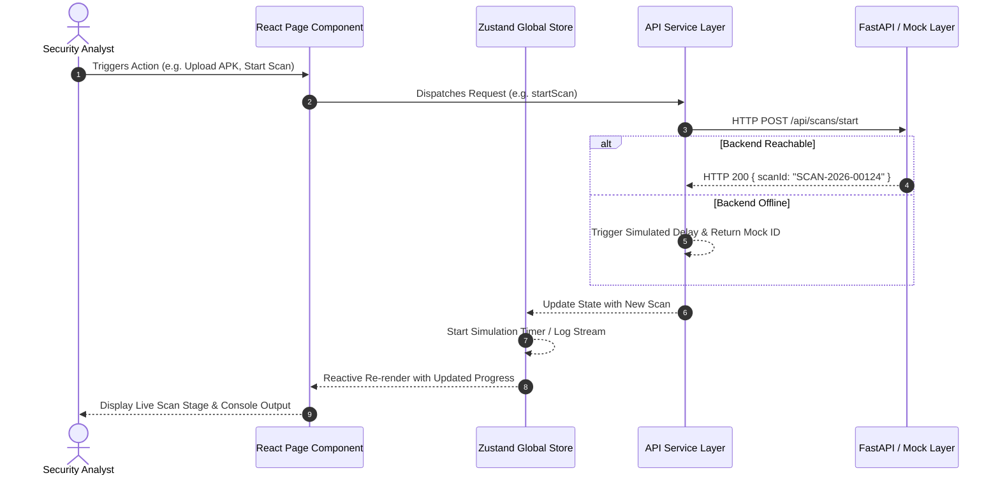
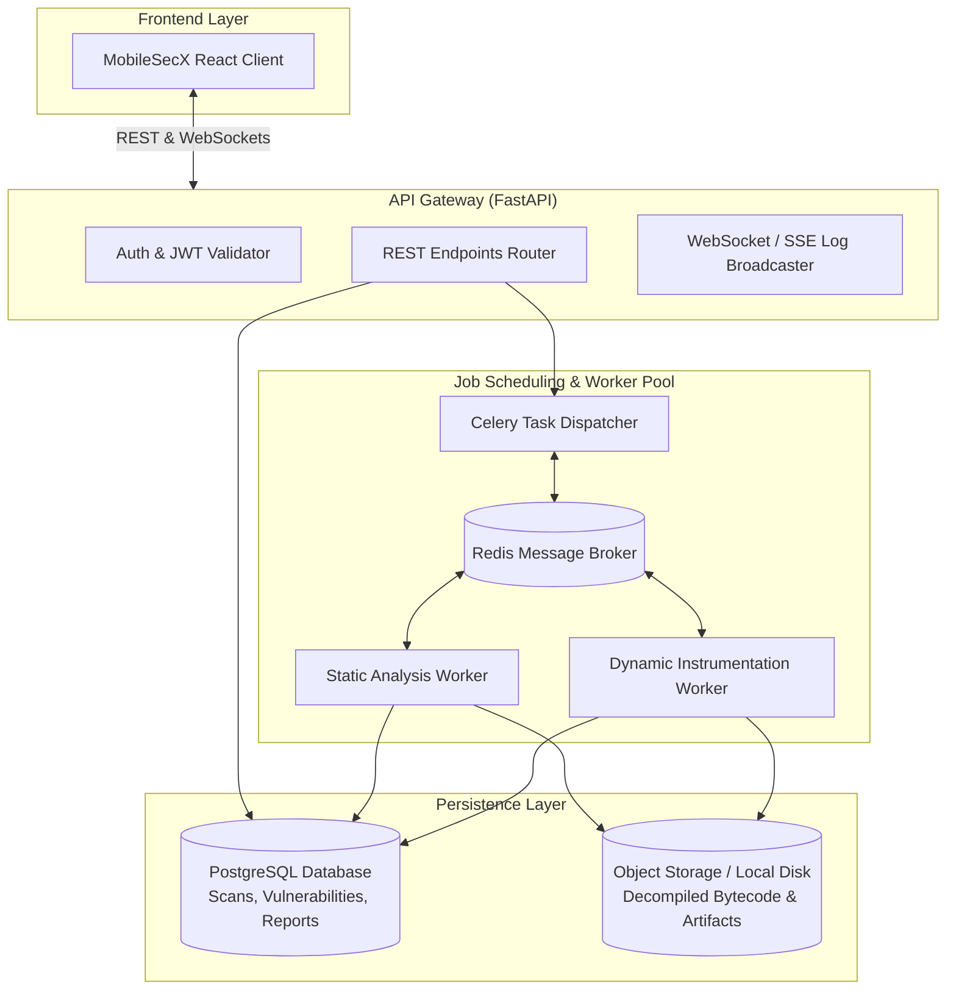
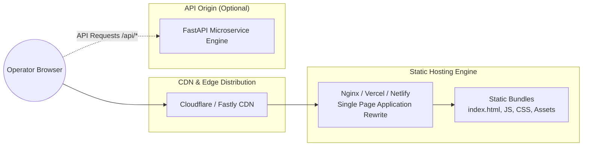

# MobileSecX Architecture Specification

This document details the architectural design, component hierarchy, data flow, and integration topology of **MobileSecX** (Mobile Application Security Testing Framework).

---

## 1. Architectural Overview

MobileSecX is engineered as a high-density, cybersecurity-focused Single Page Application (SPA). It provides a unified operator interface for mobile application security assessments across static bytecode inspection, dynamic sandbox monitoring, API surface evaluation, and OWASP compliance auditing.

The system is architected around two primary layers:
1. **Frontend Presentation & State Engine (Current Implementation)**: A React 19 + TypeScript workstation featuring custom skeuomorphic design tokens, an atomic component library, and a centralized Zustand state container.
2. **Analysis Microservice Gateway (Planned Target Architecture)**: An asynchronous FastAPI backend daemon responsible for job scheduling, file parsing, and delegating analysis jobs to headless security engines (MobSF, Frida, Burp Suite, Jadx).

---

## 2. Frontend Architecture

The frontend follows standard modular React patterns with strong separation of concerns:

```mermaid
graph TD
    subgraph Browser ["Client Runtime (Browser)"]
        Router["React Router v7<br/>Declarative Route Engine"]
        Layout["AppLayout Chassis<br/>Sidebar + Navbar + Content Slot"]
        
        subgraph Views ["Page Views (14 Routes)"]
            Dashboard["Dashboard"]
            Applications["Applications & Details"]
            Upload["Upload & Config"]
            ActiveScan["Active Scanner & Log Console"]
            Vulns["Vulnerabilities & Details"]
            ApiSec["API Security Workspace"]
            Dynamic["Dynamic Instrumentation"]
            Reversing["Reverse Engineering"]
            Owasp["OWASP Compliance"]
            History["Scan History & Diff"]
            Settings["Framework Settings"]
        end

        Store["Zustand Store (`useAppStore`)<br/>Global Reactive State"]
        Service["API Service Layer (`api.ts`)<br/>Axios + Mock Fallback"]
    end

    Router --> Layout
    Layout --> Views
    Views <--> Store
    Views --> Service
```

---

## 3. Component Architecture

The component hierarchy is organized into three distinct tiers:

### Tier 1: Atoms & Common Controls (`src/components/common/`)
Tactile, skeuomorphic primitives styled with dimensional dual-shadows and recessed panels:
- **`StatCard`**: Elevated telemetry card displaying numeric values, trend indicators, and icons.
- **`SecurityScore`**: Circular SVG instrument gauge representing aggregate risk (0–100).
- **`SeverityBadge` / `RiskBadge`**: Dimensional status chips with calm, accessible color accents.
- **`ProgressBar`**: Recessed track with beveled progress fill.
- **`TerminalViewer`**: Light-themed monospace console panel for real-time audit logs.
- **`CodeViewer`**: Syntax-highlighted code console with copy controls.
- **`Modal`**: Accessible dialog box with backdrop blur and header action slots.

### Tier 2: Domain-Specific Modules (`src/components/dashboard/`, etc.)
- **`VulnerabilityDistributionChart`**: Recharts radial/bar visualization breaking down findings by severity.
- **`VulnerabilityTrendChart`**: Recharts area chart mapping vulnerability resolution curves over time.
- **`RecentApplicationsTable`**: Tabular summary of recently ingested mobile packages.
- **`WorkflowGuide`**: Interactive four-step guide for onboarding new assessments.

### Tier 3: Chassis & Layout (`src/components/layout/`)
- **`AppLayout`**: Desktop workstation shell providing viewport constraint, responsive drawer support, and scroll management.
- **`Navbar`**: Elevated header providing global search, notification dropdowns, demo mode switch, and operator status.
- **`Sidebar`**: Vertical navigation dock displaying the MobileSecX emblem, module links, active indicator lights, and operational status LED.

---

## 4. Data Flow

Data flows unidirectionally from the service layer through the Zustand store to reactive views:

---

## 5. Service Layer Specification

The service abstraction in `src/services/api.ts` provides a clean decoupling of the UI from network communication:

- **Instance Configuration**: Axios client initialized with `baseURL: import.meta.env.VITE_API_BASE_URL || 'http://localhost:8000/api'` and a 10-second timeout.
- **Resilience Pattern (Graceful Degradation)**: Every API call is wrapped in a `try/catch` block. When a network error or timeout occurs, the service layer transparently routes the request to an internal mock handler, preventing UI crashes or blank screens.
- **Health Check Ping**: `checkBackendHealth()` issues a low-overhead `GET /api/health` request to calculate connection latency and determine server availability.

---

## 6. Mock API & Simulation Layer

To enable zero-dependency execution and offline demonstration, MobileSecX incorporates a comprehensive simulation layer:

- **Data Models**: Defined in `src/data/mockData.ts` with strict TypeScript typing matching real-world security tool outputs (CVE identifiers, CVSS v3.1 vectors, OWASP MASVS codes).
- **Scan Progression State Machine**: Implemented inside `src/store/useAppStore.ts`. When `startScan()` is called, an asynchronous timer iterates through simulated stages (`Manifest Analysis` → `Permission Analysis` → `Code Analysis` → `API Analysis` → `Dynamic Analysis` → `Report Generation`), publishing synthetic audit logs and updating the overall security score upon completion.

---

## 7. Future Backend Architecture (Planned)

The planned FastAPI backend will serve as an orchestration daemon:

---

## 8. Security Tool Integration Architecture

When connected to a live backend, MobileSecX coordinates external security utilities via standardized adapters:

| Tool | Integration Method | Data Exchanged |
| :--- | :--- | :--- |
| **MobSF** | Headless REST API (`/api/v1/upload`, `/api/v1/scan`) | Binary upload, manifest XML, decompiled Smali/Java files, static permission findings. |
| **Frida** | Python `frida-tools` daemon bridge | Custom JavaScript agent scripts injected into target process; streams runtime events (filesystem access, crypto calls, SSL pinning hooks). |
| **Burp Suite / ZAP** | REST API / Upstream Proxy | Target device proxy routing; captures HTTP/HTTPS request/response pairs, header security flags, and endpoint parameters. |
| **Jadx** | CLI wrapper execution | High-fidelity DEX-to-Java decompilation, syntax tree extraction, and resource mapping. |

---

## 9. Deployment Architecture

As a Vite-compiled client, MobileSecX produces static web assets (`dist/`) suitable for various deployment topologies:

